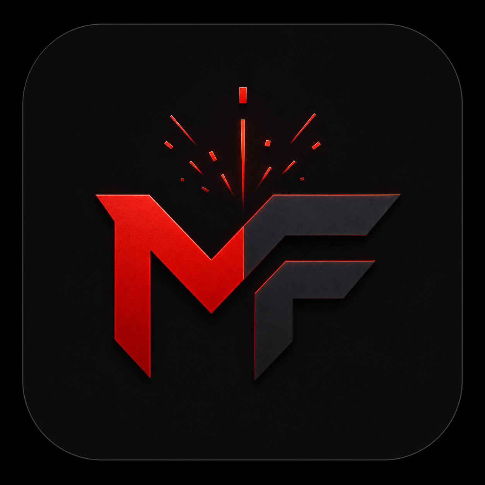
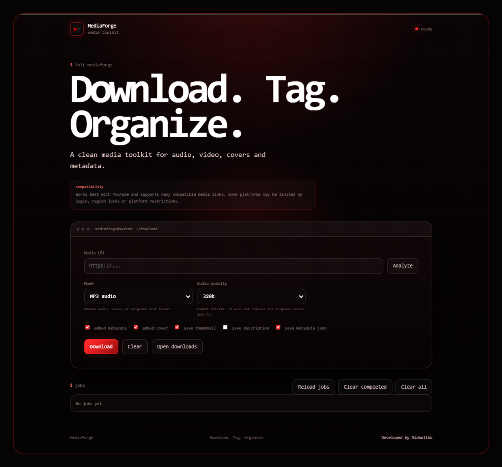

# MediaForge

<p align="center">
  
</p>

<h3 align="center">Download. Tag. Organize.</h3>

<p align="center">
  A clean media toolkit for audio, video, covers and metadata.
</p>

<p align="center">
  <a href="https://diaboliko.dev">
    
  </a>
  
  
</p>

<p align="center">
  
</p>

---

## About

**MediaForge** is a desktop-style media toolkit that helps you download media, save covers, export metadata, and keep everything organized.

It opens in your browser, runs on your machine, and stores files in clean folders by date, mode, and title.

> Use it only with content you own, public domain content, Creative Commons content, or content you have permission to download.

---

## Features

| Media                       | Metadata                     | Workflow               |
| --------------------------- | ---------------------------- | ---------------------- |
| MP3 / M4A / WEBM audio      | cover image                  | URL analysis           |
| MP4 video                   | description `.txt`           | background jobs        |
| best original format        | metadata `.json`             | organized output       |
| audio/video quality presets | embedded tags when supported | open downloads from UI |

---

## Quick Start

### Requirements

* [Python 3.11+](https://www.python.org/downloads/) installed
* [FFmpeg](https://ffmpeg.org/download.html) installed and available in PATH

Check FFmpeg with:

```powershell
ffmpeg -version
```

### Portable release

The easiest way to use MediaForge is through the portable release.

1. Download the latest `MediaForge-v1.0.2-portable.zip` from the Releases page.
2. Extract the ZIP.
3. Run `run.bat`.

MediaForge will start locally and open in your browser.

### Run from source

From the project folder, run:

```powershell
.\run.bat
```

MediaForge opens automatically at:

```txt
http://127.0.0.1:8787
```

---

## Build Portable Package

To create a clean portable ZIP from the repository:

```powershell
.\tools\build_portable.ps1 -Version v1.0.2
```

The generated ZIP is created outside the project folder.

The build script excludes development files such as `.git`, `.venv`, `__pycache__`, `.pyc` files and real downloaded media.

---

## Output

```txt
downloads/
└── 2026-05-31/
    └── audio_mp3/
        └── song_title/
            ├── song.mp3
            ├── cover.jpg
            ├── description.txt
            └── mediaforge_metadata.json
```

Repeated titles are saved safely as:

```txt
song_title_2
song_title_3
song_title_4
```

---

## Compatibility

MediaForge works best with YouTube and can also work with many compatible media links.

Examples may include:

```txt
YouTube · YouTube Music · SoundCloud · Vimeo · TikTok · Twitch · X/Twitter
```

Some platforms may require login, cookies, region access, or may block extraction. DRM-protected streaming platforms are not supported.

---

## Notes

**Video quality**
`1080p max`, `720p max`, and `480p max` mean “up to that quality when available”.

**Audio quality**
The MP3 bitrate controls the exported file. It does not improve the original source quality.

**Jobs**
Clearing jobs only clears the UI list. It does not delete downloaded files.

---

## Safety

MediaForge is intended as a private desktop utility.

Current safeguards:

* binds to `127.0.0.1`
* accepts only `http` and `https` URLs
* limits request body size
* constrains static file paths
* limits active jobs
* blocks clearing all jobs while downloads are running

Do not expose it publicly without authentication, rate limiting, and additional hardening.

---

## Project Structure

```txt
mediaforge/
├── app/
│   ├── server.py
│   ├── media.py
│   ├── jobs.py
│   ├── utils.py
│   └── static/
│       ├── assets/
│       │   ├── mediaforge-logo.png
│       │   └── preview.png
│       ├── index.html
│       ├── style.css
│       └── script.js
├── downloads/
│   └── .gitkeep
├── tools/
│   └── build_portable.ps1
├── CHANGELOG.md
├── SECURITY.md
├── requirements.txt
├── run.py
├── run.bat
├── RUN_SILENT.vbs
├── LICENSE
└── README.md
```

---

## Credits

Developed by [Diaboliko](https://diaboliko.dev)

---

## License

Released under the MIT License.
